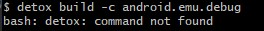

# Windows

# Troubleshootings

- # Problemas ao rodar projeto pela primeira vez

  - ## Permissão na pasta do projeto

    É possível que após clonar o repositório do projeto e tentar rodar os
    comandos:

        yarn
        npx react-native run-android

    você se depare com um problema comum de permissão de pastas.

    #### Solução

    1. Nas propriedades da pasta do projeto, vá na aba "Segurança", e em seguida
       clique em "Editar";
    2. Na nova janela que irá se abrir, clique em "Adicionar";
    3. Digite o nome do seu usuário no campo de texto e clique em "Verificar
       nomes".
    4. Seu usuário será reconhecido no campo de texto, em seguida clique em:
       OK->Aplicar->OK->OK.

  - ## Erro ao executar npx react-native run-android

    É possível que se depare com um erro semelhante ao demonstrado abaixo:

    

    #### Solução

    O erro acima é referente a alguma configuração do npx. Porém não é
    impeditivo para o bom funcionamento do seu ambiente. Para contornar este
    erro, tente rodar o projeto sem o npx:

           react-native run-android

    Com isso, você deve estar apto a continuar.

- # Problemas ao rodar os testes funcionais

  - ## Build do Detox

    Ao tentar executar o comando:

            detox build -c android.emu.debug

    você pode encontrar problemas relacionados à ausência do Detox:

    

    #### Solução

    Execute os comandos presentes no "package.json" para o build do detox em
    modo debug separadamente:

    1.              cd android/
    2.              ./gradlew assembleDebug assembleAndroidTest -DtestBuildType=debug
    3.              cd ..

    **OBS: A figura abaixo demonstra um possível erro ao executar o comando
    descrito no passo 2.**

    

    Casso esse erro ocorra, execute o comando abaixo para limpar o gradlew
    dentro da pasta android/

        ./gradlew clean

    Logo em seguida repita o comando do passo 2:

        ./gradlew assembleDebug assembleAndroidTest -DtestBuildType=debug

    Isso deve garantir a correta execção do build do Detox.

  - ## Erro ao executar yarn test

    **Antes de mais nada, certifique-se de configurar o nome correto do emulador
    Android que está utilizando no package.json (esse nome pode ser encontrado
    no próprio AVD manager do Android Studio)**

    

    

    Ao tentar executar o teste em si, rodando o comando:

            yarn test

    você pode se deparar com o seguinte erro:

    

    #### Solução

    Crie o diretório Detox.

    Na pasta do seu usuário, certifique-se de criar toda a hierarquia de de
    pastas para o diretório Detox, que será utilizado pelo comando "yarn test"
    para criar o arquivo: android-device.registry.state.lock

    Exemplo da hierarquia de pastas:

    C:/Users/PASTA_DO_SEU_USUARIO_AQUI/AppData/Local/data/Detox/

    Após isso, será possível executar o comando novamente, desta vez, com
    sucesso.

    Execute:

            yarn test
